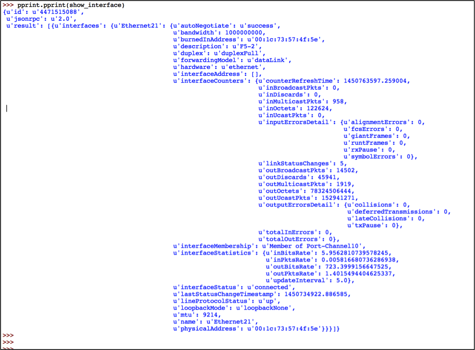
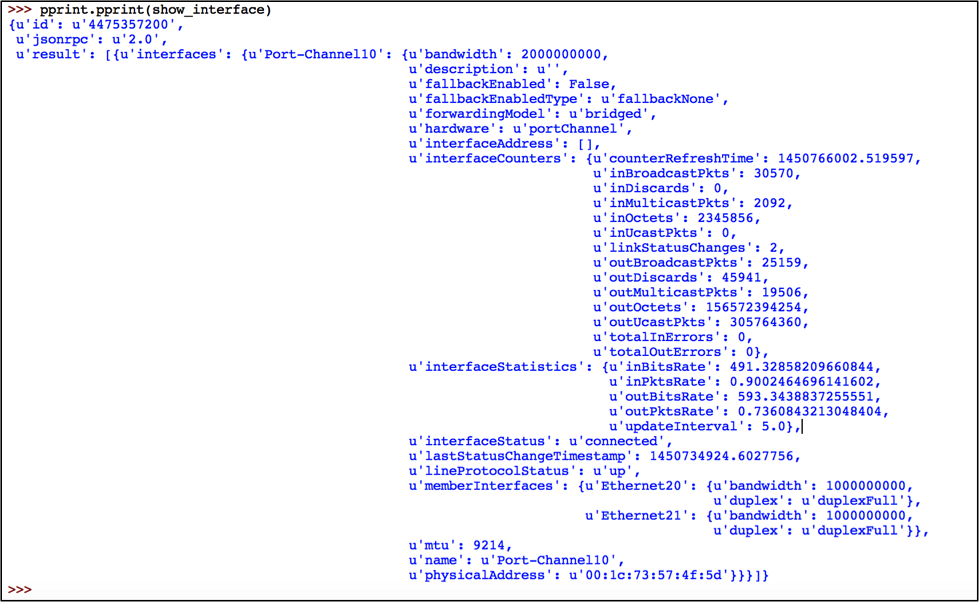

Chapter 3: Troubleshooting Use Cases
====================================

.. contents:: :local:

This chapter shows how to build Python scripts for a couple of network troubleshooting use cases. There are no new Python concepts introduced in this chapter but it gives a good practice to use the framework and Python concepts you learned so far in this book. For all the use cases, first we are going to write a high level algorithm, then we start writing the script step bt step based on the algorithm.

Monitor Data Plane Drops
------------------------

The goal of this script is to discover if there are any packet drops in any of the switches in the network. First we will write down the algorithm (or troubleshooting steps) and then we will build the script.

Algorithm:
^^^^^^^^^^

Our requirement is to list out the name of the switches, interface numbers and the corresponding drop counters. You can collect all the information using “show interfaces” command.  In this example, we are going to use “show interfaces counters discards”  to find the interfaces that see drops and then collect the “show interface” for that particular interface and get the detailed drop counters.

**Step 1:** Identify if there are any drops in the switch and obtain the interface numbers.

::

  Arista-switch# show interfaces counters discards | json
  {
      "inDiscardsTotal": 0,
      "interfaces": {
          "Ethernet8": {
              "outDiscards": 0,
              "inDiscards": 0
          },
          "Ethernet9": {
              "outDiscards": 0,
              "inDiscards": 0
          },
          "Ethernet2": {
              "outDiscards": 0,
              "inDiscards": 0
          },
          "Ethernet3": {
              "outDiscards": 0,
              "inDiscards": 0
          },
          "Ethernet1": {
              "outDiscards": 0,
              "inDiscards": 0
          },
             "Ethernet21": {
              "outDiscards": 45941,
              "inDiscards": 0
          },

**Step 2:** If any of the interfaces has non-zero counter in inDiscards or outDiscards, collect the show interface and print the detailed output or input error counters.

.. code-block:: python
  :emphasize-lines: 31,32,33,34,35,36,38,41,42,43,44,45,46,47,48,52

  Arista-switch# show interfaces ethernet 21 | json
  {
      "interfaces": {
          "Ethernet21": {
              "lastStatusChangeTimestamp": 1450734922.8865843,
              "name": "Ethernet21",
              "interfaceStatus": "connected",
              "autoNegotiate": "success",
              "burnedInAddress": "00:1c:73:57:4f:5e",
              "loopbackMode": "loopbackNone",
              "interfaceStatistics": {
                  "inBitsRate": 0.7396139208713536,
                  "inPktsRate": 0.0007222792196009312,
                  "outBitsRate": 549.4475135300596,
                  "updateInterval": 5.0,
                  "outPktsRate": 0.9075684364502475
              },
              "mtu": 9214,
              "hardware": "ethernet",
              "duplex": "duplexFull",
              "bandwidth": 1000000000,
              "forwardingModel": "dataLink",
              "lineProtocolStatus": "up",
              "interfaceCounters": {
                  "outBroadcastPkts": 11025,
                  "linkStatusChanges": 5,
                  "totalOutErrors": 0,
                  "inMulticastPkts": 754,
                  "counterRefreshTime": 1450757484.079082,
                  "inBroadcastPkts": 0,
                  "outputErrorsDetail": {
                      "deferredTransmissions": 0,
                      "txPause": 0,
                      "collisions": 0,
                      "lateCollisions": 0
                  },
                  "inOctets": 96512,
                  "outDiscards": 45941,
                  "outOctets": 78324214888,
                  "inUcastPkts": 0,
                  "inputErrorsDetail": {
                      "runtFrames": 0,
                      "rxPause": 0,
                      "fcsErrors": 0,
                      "alignmentErrors": 0,
                      "giantFrames": 0,
                      "symbolErrors": 0
                  },
                  "outUcastPkts": 152941271,
                  "outMulticastPkts": 1512,
                  "totalInErrors": 0,
                  "inDiscards": 0
              },
              "interfaceMembership": "Member of Port-Channel10",
              "interfaceAddress": [],
              "physicalAddress": "00:1c:73:57:4f:5e",
              "description": "F5-2"
          }
      }
  }

Develop Program:
^^^^^^^^^^^^^^^^

Open the IDLE and create a new program and save as interface_drops.py in your folder.
Copy the code from section 1, 2, 3 from our framework and paste it in this new program.

::

  """
  Discover if there is any packet drops in the network
  """

  ### Section 1

  import pyeapi
  import getpass
  import pprint

  ### Section 2

  # Define file path and file names

  file_path = "/Users/anees/Google Drive/my-scripts/"
  file_name_switches = "switches.txt"
  file_switches = file_path + file_name_switches

  # Read the content of the file and save it in a List

  switches = []
  with open(file_switches) as readfile:
      for line in readfile:
          switches.append(line.strip())

  ### Section 3

  # Input Username and Password

  my_username = raw_input("Enter your username: ")
  my_password = getpass.getpass("Enter your password: ")

**Step 1:** Identify interfaces having packet drops

Start section 4 with the usual ``for`` loop and pyeapi command. Collect “show interfaces counters discards” output from the switches. Later in the program we will store the result in the dictionary we name as interface_drops.

.. code-block:: python
  :emphasize-lines: 12

  ### Section 4

  interface_drops = {}
  errors = {}

  for switch in switches:
      try:
          # Define API Connection String
          node = pyeapi.connect(transport="https", host=switch, username=my_username, password=my_password, port=None)

          # Execute the desired command
          interface_counters = node.execute(["show interfaces counters discards"])

      except pyeapi.eapilib.ConnectionError:
          errors[switch] = "ConnectionError: unable to connect to eAPI"

      except pyeapi.eapilib.CommandError:
          errors[switch] = "CommandError: Check your EOS command syntax"

  ### Section 5

  pprint.pprint(errors)

Save and run the program. We are going to explore the dictionary to find the exact key to see the the packet drops.

::

  ================================ RESTART ================================
  >>>
  Enter your username: admin
  >>>
  >>> pprint.pprint(interface_counters)
  {u'id': u'4408635024',
   u'jsonrpc': u'2.0',
   u'result': [{u'inDiscardsTotal': 0,
                u'interfaces': {u'Ethernet1/1': {u'inDiscards': 0,
                                                 u'outDiscards': 0},
                                u'Ethernet10/1': {u'inDiscards': 0,
                                                  u'outDiscards': 0},
                                u'Ethernet10/2': {u'inDiscards': 0,
                                                  u'outDiscards': 0},
                                u'Ethernet10/3': {u'inDiscards': 0,
                                                  u'outDiscards': 0},

  >>> pprint.pprint(interface_counters["result"])
  [{u'inDiscardsTotal': 0,
    u'interfaces': {u'Ethernet1/1': {u'inDiscards': 0, u'outDiscards': 0},
                    u'Ethernet10/1': {u'inDiscards': 0, u'outDiscards': 0},
                    u'Ethernet10/2': {u'inDiscards': 0, u'outDiscards': 0},
                    u'Ethernet10/3': {u'inDiscards': 0, u'outDiscards': 0},
                    u'Ethernet10/4': {u'inDiscards': 0, u'outDiscards': 0},
                    u'Ethernet11/1':

  >>> pprint.pprint(interface_counters["result"][0])
  {u'inDiscardsTotal': 0,
   u'interfaces': {u'Ethernet1/1': {u'inDiscards': 0, u'outDiscards': 0},
                   u'Ethernet10/1': {u'inDiscards': 0, u'outDiscards': 0},
                   u'Ethernet10/2': {u'inDiscards': 0, u'outDiscards': 0},
                   u'Ethernet10/3': {u'inDiscards': 0, u'outDiscards': 0},
                   u'Ethernet10/4': {u'inDiscards':

  >>> pprint.pprint(interface_counters["result"][0]["interfaces"])
  {u'Ethernet1/1': {u'inDiscards': 0, u'outDiscards': 0},
   u'Ethernet10/1': {u'inDiscards': 0, u'outDiscards': 0},
   u'Ethernet10/2': {u'inDiscards': 0, u'outDiscards': 0},
   u'Ethernet10/3': {u'inDiscards': 0, u'outDiscards': 0},
   u'Ethernet10/4': {u'inDiscards': 0, u'outDiscards': 0},
   u'Ethernet11/1': {u'inDiscards': 0, u'outDiscards': 0},
   u'Ethernet11/2': {u'inDiscards': 0, u'outDiscards': 0},
   u'Ethernet11/3': {u'inDiscards': 0, u'outDiscards': 0},
   u'Ethernet11/4': {u'inDiscards': 0, u'outDiscards': 0},
   u'Ethernet12/1': {u'inDiscards': 0

  >>> interface_counters_clean = interface_counters["result"][0]["interfaces"]
  >>>
  >>> pprint.pprint(interface_counters_clean.keys())
  [u'Ethernet4/3',
   u'Ethernet55/4',
   u'Ethernet15/4',
   u'Ethernet26/3',
   u'Ethernet15/2',
   u'Ethernet54/1',
   u'Ethernet48/4',
   u'Ethernet58/4',
   u'Ethernet48/1',
   u'Ethernet48/2',
   u'Ethernet48/3',
   u'Ethernet58/3',
   u'Ethernet36/3',
   u'Ethernet36/2',

  >>> interface_counters_clean["Ethernet4/3"]
  {u'inDiscards': 0, u'outDiscards': 0}
  >>> interface_counters_clean["Ethernet4/3"]["inDiscards"]
  0
  >>> interface_counters_clean["Ethernet4/3"]["outDiscards"]
  0

For every result from a pyeapi call, our interesting data is under interface_counters [“results”] [0] [“interfaces”] key. Now we know the counters to see the packet drops which is interface_counters_clean [<interface>] [“inDiscards”].

**Step 2:** Collect the Input/Output Drops Statistics

We are going to iterate through the interfaces within each switch and look for non zero counters. If we see a non zero counter, we will initiate a pyeapi call to collect the “show interface” for that specific interface.

.. code-block:: python
  :emphasize-lines: 13,19,20,21

  ### Section 4

  interface_drops = {}
  errors = {}

  for switch in switches:
      try:
          # Define API Connection String
          node = pyeapi.connect(transport="https", host=switch, username=my_username, password=my_password, port=None)

          # Execute the desired command
          interface_counters = node.execute(["show interfaces counters discards"])
          interface_counters_clean = interface_counters["result"][0]["interfaces"]

          """
          Parse through each interface and see if there any non zero inDiscards or outDiscards.
          If any interface has non zero counters, collect "show interface" ouput of that interface
          """
          for interface in interface_counters_clean.keys():
              if interface_counters_clean[interface]["inDiscards"] or interface_counters_clean[interface]["outDiscards"] != 0:
                  show_interface = node.execute(["show interfaces " + str(interface)])

      except pyeapi.eapilib.ConnectionError:
          errors[switch] = "ConnectionError: unable to connect to eAPI"

      except pyeapi.eapilib.CommandError:
          errors[switch] = "CommandError: Check your EOS command syntax"

  ### Section 5

  pprint.pprint(errors)

Save and run the script. Now we are going to explore within the “show interface” output, what are the specific counters to collect and report.

::

  >>> show_interface["result"][0]["interfaces"]["Ethernet21"]["interfaceCounters"]["inputErrorsDetail"]

  {u'runtFrames': 0, u'fcsErrors': 0, u'alignmentErrors': 0, u'rxPause': 0, u'symbolErrors': 0, u'giantFrames': 0}

  >>> show_interface["result"][0]["interfaces"]["Ethernet21"]["interfaceCounters"]["outputErrorsDetail"]

  {u'lateCollisions': 0, u'deferredTransmissions': 0, u'txPause': 0, u'collisions': 0}

Now we know the key for the input and output error details. What we need to know is to whether to collect the input or output error details. You can use if statements to collect input or output error details depends on whether you see input or output discards.

.. code-block:: python
  :emphasize-lines: 22,23,24,25,26

  ### Section 4

  interface_drops = {}
  errors = {}

  for switch in switches:
      try:
          # Define API Connection String
          node = pyeapi.connect(transport="https", host=switch, username=my_username, password=my_password, port=None)

          # Execute the desired command
          interface_counters = node.execute(["show interfaces counters discards"])
          interface_counters_clean = interface_counters["result"][0]["interfaces"]

          """
          Parse through each interface and see if there any non zero inDiscards or outDiscards.
          If any interface has non zero counters, collect "show interface" ouput of that interface
          """
          for interface in interface_counters_clean.keys():
              if interface_counters_clean[interface]["inDiscards"] or interface_counters_clean[interface]["outDiscards"] != 0:
                  show_interface = node.execute(["show interfaces " + str(interface)])
                  show_interface_clean = show_interface["result"][0]["interfaces"][interface]["interfaceCounters"]
                  if interface_counters_clean[interface]["inDiscards"] != 0:
                      print show_interface_clean["inputErrorsDetail"]
                  if interface_counters_clean[interface]["outDiscards"] != 0:
                      print show_interface_clean["outputErrorsDetail"]

      except pyeapi.eapilib.ConnectionError:
          errors[switch] = "ConnectionError: unable to connect to eAPI"

      except pyeapi.eapilib.CommandError:
          errors[switch] = "CommandError: Check your EOS command syntax"

  ### Section 5

  pprint.pprint(errors)

Save and run the script.

::

  >>> ================================ RESTART ================================
  >>>
  Enter your username: admin

  Traceback (most recent call last):
    File "/Users/anees/Google Drive/my-scripts/interface_drops.py", line 60, in <module>
      print show_interface_clean["outputErrorsDetail"]
  KeyError: 'outputErrorsDetail'

We are seeing an error message in the above output. It says that there is no key ouputErrorsDetail in the show interface <specific interface>. If you pprint the show interface <specific interface> output, you can see that there are no outputErrorsDetail key under interfaceCounters section. This is because the output shown is for port channel interface. This specific counter is applicable only for physical interface. So we are going to add a check so that if the interface is port channel, we are not going to look for any counters.

We are going to do the interface check using “if ‘Port-Channel’ not in interface:” logic. It would be better idea to use this logic “if ‘Ethernet’ in interface:” instead of “ ‘Port-Channel’ not in:”. Because show interfaces will also contains SVIs. We need to look at only the Ethernet interfaces. However for learning perspective, we are going to use “if ‘Port-Channel’ not in interface:”.

.. code-block:: python
  :emphasize-lines: 20

  ### Section 4

  interface_drops = {}
  errors = {}

  for switch in switches:
      try:
          # Define API Connection String
          node = pyeapi.connect(transport="https", host=switch, username=my_username, password=my_password, port=None)

          # Execute the desired command
          interface_counters = node.execute(["show interfaces counters discards"])
          interface_counters_clean = interface_counters["result"][0]["interfaces"]

          """
          Parse through each interface and see if there any non zero inDiscards or outDiscards.
          If any interface has non zero counters, collect "show interface" output of that interface
          """
          for interface in interface_counters_clean.keys():
              if "Port-Channel" not in interface:
                  if interface_counters_clean[interface]["inDiscards"] or interface_counters_clean[interface]["outDiscards"] != 0:
                      show_interface = node.execute(["show interfaces " + str(interface)])
                      show_interface_clean = show_interface["result"][0]["interfaces"][interface]["interfaceCounters"]
                      if interface_counters_clean[interface]["inDiscards"] != 0:
                          print show_interface_clean["inputErrorsDetail"]
                      if interface_counters_clean[interface]["outDiscards"] != 0:
                          print show_interface_clean["outputErrorsDetail"]

      except pyeapi.eapilib.ConnectionError:
          errors[switch] = "ConnectionError: unable to connect to eAPI"

      except pyeapi.eapilib.CommandError:
          errors[switch] = "CommandError: Check your EOS command syntax"

  ### Section 5

  pprint.pprint(errors)

Save and run the script.

::

  >>> ================================ RESTART ================================
  >>>
  Enter your username: admin

  {u'lateCollisions': 0, u'deferredTransmissions': 0, u'txPause': 0, u'collisions': 0}
  {}

**Step 3:** Saving the Result in a Dictionary

Let us store the result in a nice format in a dictionary.

::

  Interface_drops =
  {

  Switch_host_name: {
  		          Interface_number: {
  				    “Interface status”: <value>
  				    “Line Protocol Status”: <value>
  				    “inDiscards”: {
  						“Total Discards”: <value>
  						InputErrorsDetail: {
  								      }
  				    “outDiscards”: {
  						  “Total Discards”:
  						  “outputErrorsDetail”:{
  								         }
  }

First you need to initiate the dictionary when you start the section 4 in the script.

.. code-block:: python
  :emphasize-lines: 1

  interface_drops = {}
  for switch in switches:

For every switch, create a key, value pair in the interface_drops dictionary. Here, the value is another dictionary. Since it has to be created for each switch, we create this line inside the “for loop” of the switches. You need to get the hostname of the switch using the command “show hostname”.

.. code-block:: python
  :emphasize-lines: 1,5,6,7

  interface_drops = {}
  for switch in switches:
      try:
          # lines skipped
          host_name = node.execute(["show hostname"])
          host_name_clean = str(host_name["result"][0]["hostname"])
          interface_drops[host_name_clean] = {}

For each switch, we need to create a key, value pair for the interface we are seeing packet drops. This statement should be inside the “for loop” of the interfaces of each switch. Since we need to create the key, value pair only if you see any packet drops, this line will be inside the if statement.

.. code-block:: python
  :emphasize-lines: 1,5,8

  interface_drops = {}
  for switch in switches:
      try:
          # lines skipped
          interface_drops[host_name_clean] = {}
          for interface in interface_counters_clean.keys():
              if interface_counters_clean[interface]["inDiscards"] or interface_counters_clean[interface]["outDiscards"] != 0:
                      interface_drops[host_name_clean][interface] = {}

If there is any input discards, we will record the total input discards and input error statistics.

.. code-block:: python
  :emphasize-lines: 3,4

  if interface_counters_clean[interface]["inDiscards"] != 0:
      interface_drops[host_name_clean][interface]["inDiscards"] = {}
      interface_drops[host_name_clean][interface]["inDiscards"]["Total Discards"] = interface_counters_clean[interface]["inDiscards"]
      interface_drops[host_name_clean][interface]["inDiscards"]["Input Errors"] = show_interface_clean["inputErrorsDetail"]

Similarly if there is any output discards, then we will record the total output discards and output error statistics.

.. code-block:: python
  :emphasize-lines: 3,4

  if interface_counters_clean[interface]["outDiscards"] != 0:
      interface_drops[host_name_clean][interface]["outDiscards"] = {}
      interface_drops[host_name_clean][interface]["outDiscards"]["Total Discards"] = interface_counters_clean[interface]["outDiscards"]
      interface_drops[host_name_clean][interface]["outDiscards"]["Output Errors"] = show_interface_clean["outputErrorsDetail"]

Now let us look at the section 4 of the script we have developed so far.

.. code-block:: python
  :emphasize-lines: 16,17,18,30,37,38,42,43,44,46,47,48

  ### Section 4

  interface_drops = {}
  errors = {}

  for switch in switches:
      try:
          # Define API Connection String
          node = pyeapi.connect(transport="https", host=switch, username=my_username, password=my_password, port=None)

          # Execute the desired command
          interface_counters = node.execute(["show interfaces counters discards"])
          interface_counters_clean = interface_counters["result"][0]["interfaces"]

          # Collect hostname for documenting results under the host name
          host_name = node.execute(["show hostname"])
          host_name_clean = str(host_name["result"][0]["hostname"])
          interface_drops[host_name_clean] = {}

          """
          Parse through each interface and see if there any non zero inDiscards or outDiscards.
          If any interface has non zero counters, collect "show interface" output of that interface
          """

          for interface in interface_counters_clean.keys():
              # Skip if the interface is port channel
              if "Port-Channel" not in interface:
                  if interface_counters_clean[interface]["inDiscards"] or interface_counters_clean[interface]["outDiscards"] != 0:
                      # Create an entry for the interface under the host name
                      interface_drops[host_name_clean][interface] = {}

                      # Collect the interface statistics from the switch
                      show_interface = node.execute(["show interfaces " + str(interface)])
                      show_interface_clean = show_interface["result"][0]["interfaces"][interface]["interfaceCounters"]

                      # Collect interface and line protocol status just for documentation purpose
                      interface_drops[host_name_clean][interface]["Interface Status"] = show_interface["result"][0]["interfaces"][interface]["interfaceStatus"]
                      interface_drops[host_name_clean][interface]["Line Protocol Status"] = show_interface["result"][0]["interfaces"][interface]["lineProtocolStatus"]

                      # Collect detailed input or output drop counters if there are input or output drops
                      if interface_counters_clean[interface]["inDiscards"] != 0:
                          interface_drops[host_name_clean][interface]["inDiscards"] = {}
                          interface_drops[host_name_clean][interface]["inDiscards"]["Total Discards"] = interface_counters_clean[interface]["inDiscards"]
                          interface_drops[host_name_clean][interface]["inDiscards"]["Input Errors"] = show_interface_clean["inputErrorsDetail"]
                      if interface_counters_clean[interface]["outDiscards"] != 0:
                          interface_drops[host_name_clean][interface]["outDiscards"] = {}
                          interface_drops[host_name_clean][interface]["outDiscards"]["Total Discards"] = interface_counters_clean[interface]["outDiscards"]
                          interface_drops[host_name_clean][interface]["outDiscards"]["Output Errors"] = show_interface_clean["outputErrorsDetail"]

      except pyeapi.eapilib.ConnectionError:
          errors[switch] = "ConnectionError: unable to connect to eAPI"

      except pyeapi.eapilib.CommandError:
          errors[switch] = "CommandError: Check your EOS command syntax"

  ### Section 5

  pprint.pprint(errors)
  pprint.pprint(interface_drops)

Save and run the script.

::

  >>> ================================ RESTART ================================
  >>>
  Enter your username: admin
  {}
  {'22sw2': {u'Ethernet21': {'Interface Status': u'connected',
                             'Line Protocol Status': u'up',
                             'outDiscards': {'Output Errors': {u'collisions': 0,
                                                            u'deferredTransmissions': 0,
                                                               u'lateCollisions': 0,
                                                               u'txPause': 0},
                                             'Total Discards': 45941}}},
   '22sw35': {},
   '22sw37': {},
   '22sw4': {}}

As you see, we are seeing some of the empty dictionaries printed in the output. We can add additional checks in the code to print non empty dictionaries. For example the first empty dictionary { } in the output is printed as part of pprint.pprint(errors). We want to print only the non empty dictionaries.

The following is one of the methods to check whether a dictionary is empty or not:

::

  anees:~ anees$ python
  Python 2.7.10 (default, Aug 22 2015, 20:33:39)
  [GCC 4.2.1 Compatible Apple LLVM 7.0.0 (clang-700.0.59.1)] on darwin
  Type "help", "copyright", "credits" or "license" for more information.
  >>> # Create an empty dictionary
  >>> errors = { }
  >>>
  >>> not errors
  True
  >>>
  >>> bool(errors)
  False
  >>>
  >>> if not errors:
  ...     print "Empty Dictionary"
  ...
  Empty Dictionary
  >>>
  >>> # Create a non empty dictionary
  >>> errors = {"test":{}}
  >>>
  >>> not errors
  False
  >>>
  >>> bool(errors)
  True
  >>> if bool(errors):
  ...     print "NOT Empty"
  ...
  NOT Empty

With these additional checks, we will print errors only if the errors dictionary is non empty and we will not save the switch entry if there are no drops found in that switch.

.. code-block:: python
  :emphasize-lines: 50,51,61,62,64,65

  ### Section 4

  interface_drops = {}
  errors = {}

  for switch in switches:
      try:
          # Define API Connection String
          node = pyeapi.connect(transport="https", host=switch, username=my_username, password=my_password, port=None)

          # Execute the desired command
          interface_counters = node.execute(["show interfaces counters discards"])
          interface_counters_clean = interface_counters["result"][0]["interfaces"]

          # Collect hostname for documenting results under the host name
          host_name = node.execute(["show hostname"])
          host_name_clean = str(host_name["result"][0]["hostname"])
          interface_drops[host_name_clean] = {}

          """
          Parse through each interface and see if there any non zero inDiscards or outDiscards.
          If any interface has non zero counters, collect "show interface" output of that interface
          """

          for interface in interface_counters_clean.keys():
              # Skip if the interface is port channel
              if "Port-Channel" not in interface:
                  if interface_counters_clean[interface]["inDiscards"] or interface_counters_clean[interface]["outDiscards"] != 0:
                      # Create an entry for the interface under the host name
                      interface_drops[host_name_clean][interface] = {}

                      # Collect the interface statistics from the switch
                      show_interface = node.execute(["show interfaces " + str(interface)])
                      show_interface_clean = show_interface["result"][0]["interfaces"][interface]["interfaceCounters"]

                      # Collect interface and line protocol status just for documentation purpose
                      interface_drops[host_name_clean][interface]["Interface Status"] = show_interface["result"][0]["interfaces"][interface]["interfaceStatus"]
                      interface_drops[host_name_clean][interface]["Line Protocol Status"] = show_interface["result"][0]["interfaces"][interface]["lineProtocolStatus"]

                      # Collect detailed input or output drop counters if there are input or output drops
                      if interface_counters_clean[interface]["inDiscards"] != 0:
                          interface_drops[host_name_clean][interface]["inDiscards"] = {}
                          interface_drops[host_name_clean][interface]["inDiscards"]["Total Discards"] = interface_counters_clean[interface]["inDiscards"]
                          interface_drops[host_name_clean][interface]["inDiscards"]["Input Errors"] = show_interface_clean["inputErrorsDetail"]
                      if interface_counters_clean[interface]["outDiscards"] != 0:
                          interface_drops[host_name_clean][interface]["outDiscards"] = {}
                          interface_drops[host_name_clean][interface]["outDiscards"]["Total Discards"] = interface_counters_clean[interface]["outDiscards"]
                          interface_drops[host_name_clean][interface]["outDiscards"]["Output Errors"] = show_interface_clean["outputErrorsDetail"]

          if not interface_drops[host_name_clean]:
              del interface_drops[host_name_clean]

      except pyeapi.eapilib.ConnectionError:
          errors[switch] = "ConnectionError: unable to connect to eAPI"

      except pyeapi.eapilib.CommandError:
          errors[switch] = "CommandError: Check your EOS command syntax"

  ### Section 5

  if bool(errors):
      pprint.pprint(errors)

  if bool(interface_drops):
      pprint.pprint(interface_drops)

Save and run the script. You will no longer see the empty dictionaries.

::

  ================================ RESTART ================================
  >>>
  Enter your username: admin
  {'22sw2': {u'Ethernet21': {'Interface Status': u'connected',
                             'Line Protocol Status': u'up',
                             'outDiscards': {'Output Errors': {u'collisions': 0,
                                                            u'deferredTransmissions': 0,
                                                               u'lateCollisions': 0,
                                                               u'txPause': 0},
                                             'Total Discards': 45941}}}}

**Step 4:** Tracking interfaces with incrementing packet drops

If you want to find the interface that has incrementing packet drops, we need to add additional logic to the script. The logic which we are going to use here is that first we will discover all the interfaces having non zero packet drops by using the script we developed. Then we will wait for 1 minute and again collect the statistics for the same interfaces we have noticed packet drops and compare the result. If there is a difference, we will save the new statistics in the dictionary.

.. code-block:: python
  :emphasize-lines: 3,12,13,14,15,16

  ### Section 1

  import time

  ### Section 4

  for switch in switches:
      try:

          for interface in interface_counters_clean.keys():
              if "Port-Channel" not in interface:
                  if interface_counters_clean[interface]["inDiscards"] or interface_counters_clean[interface]["outDiscards"] != 0:
                      time.sleep(60)
                      interface_counters_new = node.execute(["show interfaces " + str(interface) + " counters discards"])
                      interface_counters_new_clean = interface_counters_new["result"][0]["interfaces"]
                      input_discards_difference = interface_counters_new_clean[interface]["inDiscards"] - interface_counters_clean[interface]["inDiscards"]
                      output_discards_difference = interface_counters_new_clean[interface]["outDiscards"] - interface_counters_clean[interface]["outDiscards"]

Now we will add the if statement to verify if there is any difference in the packet drops counters, we will store the result in the dictionary.

::

  if input_discards_difference or output_discards_difference != 0:
      interface_drops[host_name_clean][interface] = {}
      show_interface = node.execute(["show interfaces " + str(interface)])
      show_interface_clean = show_interface["result"][0]["interfaces"][interface]["interfaceCounters"]
      interface_drops[host_name_clean][interface]["Interface Status"] = show_interface["result"][0]["interfaces"][interface]["interfaceStatus"]
      interface_drops[host_name_clean][interface]["Line Protocol Status"] = show_interface["result"][0]["interfaces"][interface]["lineProtocolStatus"]

      if interface_counters_new_clean[interface]["inDiscards"] != 0:
          interface_drops[host_name_clean][interface]["inDiscards"] = {}
          interface_drops[host_name_clean][interface]["inDiscards"]["Total Discards"] = interface_counters_new_clean[interface]["inDiscards"]
          interface_drops[host_name_clean][interface]["inDiscards"]["Input Errors"] = show_interface_clean["inputErrorsDetail"]

      if interface_counters_new_clean[interface]["outDiscards"] != 0:
          interface_drops[host_name_clean][interface]["outDiscards"] = {}
          interface_drops[host_name_clean][interface]["outDiscards"]["Total Discards"] = interface_counters_new_clean[interface]["outDiscards"]
          interface_drops[host_name_clean][interface]["outDiscards"]["Output Errors"] = show_interface_clean["outputErrorsDetail"]

Final Script:
^^^^^^^^^^^^^

Here is the final script that shows if there are any continuous packet drops in the network.

::

  """
  Discover if there is any packet drops in the network
  """

  ### Section 1

  import pyeapi
  import getpass
  import pprint
  import time

  ### Section 2

  # Define file path and file names

  file_path = "/Users/anees/Google Drive/my-scripts/"
  file_name_switches = "switches.txt"
  file_switches = file_path + file_name_switches

  # Read the content of the file and save it in a List

  switches = []
  with open(file_switches) as readfile:
      for line in readfile:
          switches.append(line.strip())

  ### Section 3

  # Input Username and Password

  my_username = raw_input("Enter your username: ")
  my_password = getpass.getpass("Enter your password: ")

  ### Section 4

  interface_drops = {}
  errors = {}

  for switch in switches:
      try:
          # Define API Connection String
          node = pyeapi.connect(transport="https", host=switch, username=my_username, password=my_password, port=None)

          # Collect the interface drops statistics from the switch
          interface_counters = node.execute(["show interfaces counters discards"])
          interface_counters_clean = interface_counters["result"][0]["interfaces"]

          # Collect hostname for documenting results under the host name
          host_name = node.execute(["show hostname"])
          host_name_clean = str(host_name["result"][0]["hostname"])
          interface_drops[host_name_clean] = {}

          """
          Parse through each interface and see if there any non zero inDiscards or outDiscards.
          If any interface has non zero counters, collect "show interface" output of that interface
          """

          for interface in interface_counters_clean.keys():
              # Skip if the interface is port channel
              if "Port-Channel" not in interface:
                  if interface_counters_clean[interface]["inDiscards"] or interface_counters_clean[interface]["outDiscards"] != 0:
                      # Collect interface drops statistics for this specific interface after 1 minute
                      time.sleep(60)
                      interface_counters_new = node.execute(["show interfaces " + str(interface) + " counters discards"])
                      interface_counters_new_clean = interface_counters_new["result"][0]["interfaces"]

                      # Identify the difference in packet drops
                      input_discards_difference = interface_counters_new_clean[interface]["inDiscards"] - interface_counters_clean[interface]["inDiscards"]
                      output_discards_difference = interface_counters_new_clean[interface]["outDiscards"] - interface_counters_clean[interface]["outDiscards"]

                      # If the packet drops counter increments, collect and store detailed statistics in the dictionary
                      if input_discards_difference or output_discards_difference != 0:
                          interface_drops[host_name_clean][interface] = {}
                          show_interface = node.execute(["show interfaces " + str(interface)])
                          show_interface_clean = show_interface["result"][0]["interfaces"][interface]["interfaceCounters"]

                          # Collect interface and line protocol status just for documentation purpose
                          interface_drops[host_name_clean][interface]["Interface Status"] = show_interface["result"][0]["interfaces"][interface]["interfaceStatus"]
                          interface_drops[host_name_clean][interface]["Line Protocol Status"] = show_interface["result"][0]["interfaces"][interface]["lineProtocolStatus"]

                          # Collect detailed input or output drop counters
                          if interface_counters_new_clean[interface]["inDiscards"] != 0:
                              interface_drops[host_name_clean][interface]["inDiscards"] = {}
                              interface_drops[host_name_clean][interface]["inDiscards"]["Total Discards"] = interface_counters_new_clean[interface]["inDiscards"]
                              interface_drops[host_name_clean][interface]["inDiscards"]["Input Errors"] = show_interface_clean["inputErrorsDetail"]

                          if interface_counters_new_clean[interface]["outDiscards"] != 0:
                              interface_drops[host_name_clean][interface]["outDiscards"] = {}
                              interface_drops[host_name_clean][interface]["outDiscards"]["Total Discards"] = interface_counters_new_clean[interface]["outDiscards"]
                              interface_drops[host_name_clean][interface]["outDiscards"]["Output Errors"] = show_interface_clean["outputErrorsDetail"]

          # Delete the dictionary entry for the switch if the switch does not have any incremental packet drops
          if not interface_drops[host_name_clean]:
              del interface_drops[host_name_clean]

      except pyeapi.eapilib.ConnectionError:
          errors[switch] = "ConnectionError: unable to connect to eAPI"

      except pyeapi.eapilib.CommandError:
          errors[switch] = "CommandError: Check your EOS command syntax"

  ### Section 5

  # print the result only if the dictionary is non empty
  if bool(errors):
      pprint.pprint(errors)

  if bool(interface_drops):
      pprint.pprint(interface_drops)

Change the troubleshooting steps and modify the script as per your troubleshooting approach. In this use case, we collect interface drop statistics in 1 minute interval for each interface from each switch that sees packet drops. You can modify this logic in different ways. Instead of waiting for 1 minute for each interface of each switches, you can collect interface drop statistics in 1 minute interval for each switch. Or You can collect interface drop statistics in 1 minute interval for all the switches at once and compare the results.

Monitor Control Plane Drops
---------------------------

The goal of this script is to discover if there are any control plane drops in any of the switches in the network. First we will write down the algorithm (or troubleshooting steps) and then we will build the script.

Algorithm:
^^^^^^^^^^

**Step 1:** Identify if there are any control plane drops in the switch

.. code-block:: console
  :emphasize-lines: 3,4,6,26,34,36

  Arista-switch#show policy-map interface control-plane copp-system-policy | json
  {
      "policyMaps": {
          "copp-system-policy": {
              "mapType": "mapControlPlane",
              "classMaps": {
                  "copp-system-ptp": {
                      "shape": {
                          "unit": "pps",
                          "rate": 2500
                      },
                      "classPrio": 13,
                      "mapType": "mapControlPlane",
                      "matchCondition": "matchConditionAny",
                      "intfPacketCounters": {
                          "outPackets": 0,
                          "dropPackets": 0
                      },
                      "bandwidth": {
                          "unit": "pps",
                          "rate": 500
                      },
                      "match": {},
                      "name": "copp-system-ptp"
                  },
                  "copp-system-arp": {
                      "shape": {
                          "unit": "pps",
                          "rate": 10000
                      },
                      "classPrio": 19,
                      "mapType": "mapControlPlane",
                      "matchCondition": "matchConditionAny",
                      "intfPacketCounters": {
                          "outPackets": 192696,
                          "dropPackets": 0
                      },
                      "bandwidth": {
                          "unit": "pps",
                          "rate": 1000
                      },
                      "match": {},
                      "name": "copp-system-arp"
                  },

**Step 2:** If we find any of the copp classes have drops, we will save the result in a directory.

.. code-block:: console

  Copp_drops = {
                 “switch_host_name”: {
                 “copp-class-map-name”: {
                                          “droppackets”: <no of dropped packets>
                                        }
                                      }

**Step 3:** We will add the logic to show the control plane drops only if the counters are incrementing.

Develop Program:
^^^^^^^^^^^^^^^^

**Step 1:** Initial Program and explore output counters

Open the IDLE and create a new program and save as copp_drops.py in your folder.
Copy the code from section 1, 2, 3 from our framework and paste it in this new program.

::

  """
  Discover if there is any control plane drops in the network
  """

  ### Section 1

  import pyeapi
  import getpass
  import pprint

  ### Section 2

  # Define file path and file names

  file_path = "/Users/anees/Google Drive/my-scripts/"
  file_name_switches = "switches.txt"
  file_switches = file_path + file_name_switches

  # Read the content of the file and save it in a List

  switches = []
  with open(file_switches) as readfile:
      for line in readfile:
          switches.append(line.strip())

  ### Section 3

  # Input Username and Password

  my_username = raw_input("Enter your username: ")
  my_password = getpass.getpass("Enter your password: ")

Start section 4 with the usual “for loop” and pyeapi command. Collect “show policy-map interface control-plane copp-system-policy” output from the switches. Then from IDLE shell, we will explore how to pull the required counters.

.. code-block:: python
  :emphasize-lines: 12

  ### Section 4

  copp_drops = {}
  errors = {}

  for switch in switches:
      try:
          # Define API Connection String
          node = pyeapi.connect(transport="https", host=switch, username=my_username, password=my_password, port=None)

          # Execute the desired command
          copp_counters = node.execute(["show policy-map interface control-plane copp-system-policy"])

      except pyeapi.eapilib.ConnectionError:
          errors[switch] = "ConnectionError: unable to connect to eAPI"

      except pyeapi.eapilib.CommandError:
          errors[switch] = "CommandError: Check your EOS command syntax"

  ### Section 5

  if bool(errors):
      pprint.pprint(errors)

Save and run the program.

::

  >>> ================================ RESTART ================================
  >>>
  Enter your username: admin
  >>> pprint.pprint(copp_counters)
  {u'id': u'4585156240',
   u'jsonrpc': u'2.0',
   u'result': [{u'policyMaps': {u'copp-system-policy': {u'classMaps': {u'copp-system-OspfIsis': {u'bandwidth': {u'rate': 5000,

  >>> pprint.pprint(copp_counters["result"][0]["policyMaps"]["copp-system-policy"]["classMaps"])
  {u'copp-system-OspfIsis': {u'bandwidth': {u'rate': 5000, u'unit': u'pps'},
                             u'classPrio': 11,
                             u'intfPacketCounters': {u'dropPackets': 0,
                                                     u'outPackets': 0},
                             u'mapType': u'mapControlPlane',
                             u'match': {},
                             u'matchCondition': u'matchConditionAny',
                             u'name': u'copp-system-OspfIsis',
                             u'shape': {u'rate': 10000, u'unit': u'pps'}},
   u'copp-system-acllog': {u'bandwidth': {u'rate': 1000, u'unit': u'pps'},
                           u'classPrio': 30,
                           u'intfPacketCounters': {u'dropPackets': 0,
                                                   u'outPackets': 0},
                           u'mapType': u'mapControlPlane',
                           u'match': {},
                           u'matchCondition': u'matchConditionAny',
                           u'name': u'copp-system-acllog',
                           u'shape': {u'rate': 10000, u'unit': u'pps'}},

  >>> copp_counters_clean = copp_counters["result"][0]["policyMaps"]["copp-system-policy"]["classMaps"]
  >>>
  >>> copp_counters_clean["copp-system-acllog"]["intfPacketCounters"]["dropPackets"]
  0
  >>>
  >>> copp_counters_clean.keys()
  [u'copp-system-selfip', u'copp-system-tc6to7', u'copp-system-l3slowpath', u'copp-system-arp', u'copp-system-lacp', u'copp-system-arpresolver', u'copp-system-tc3to5', u'copp-system-default', u'copp-system-bpdu', u'copp-system-pim', u'copp-system-vxlan-vtep-learn', u'copp-system-urm', u'copp-system-bfd', u'copp-system-vxlan-encapsulation', u'copp-system-ipmcrsvd', u'copp-system-mlag', u'copp-system-igmp', u'copp-system-lldp', u'copp-system-ptp', u'copp-system-vrrp', u'copp-system-l3ttl1', u'copp-system-selfip-tc6to7', u'copp-system-acllog', u'copp-system-cvx', u'copp-system-l3destmiss', u'copp-system-OspfIsis', u'copp-system-cvx-heartbeat', u'copp-system-sflow', u'copp-system-ipmcmiss', u'copp-system-glean', u'copp-system-bgp']

**Step 2:** Add logic to discover Non Zero Counters and print the result

Since we know what counters to look, we will use if statement to verify for non zero counters. If we find a non zero counter, we will print the host name, copp policy name and drop packets counter.

.. code-block:: python
  :emphasize-lines: 16,17,18

  ### Section 4

  copp_drops = {}
  errors = {}

  for switch in switches:
      try:
          # Define API Connection String
          node = pyeapi.connect(transport="https", host=switch, username=my_username, password=my_password, port=None)

          # Execute the desired command
          copp_counters = node.execute(["show policy-map interface control-plane copp-system-policy"])
          copp_counters_clean = copp_counters["result"][0]["policyMaps"]["copp-system-policy"]["classMaps"]

          # parse through each copp system class map and discover non drop counters
          for each_copp_class in copp_counters_clean.keys():
              if copp_counters_clean[each_copp_class]["intfPacketCounters"]["dropPackets"] != 0:
                  print host_name_clean, each_copp_class, copp_counters_clean[each_copp_class]["intfPacketCounters"]["dropPackets"]

      except pyeapi.eapilib.ConnectionError:
          errors[switch] = "ConnectionError: unable to connect to eAPI"

      except pyeapi.eapilib.CommandError:
          errors[switch] = "CommandError: Check your EOS command syntax"

  ### Section 5

  if bool(errors):
      pprint.pprint(errors)

Save and run the script.

::

  >>> ================================ RESTART ================================
  >>>
  Enter your username: admin
  22sw2 copp-system-glean 1033427
  22sw4 copp-system-glean 2228369
  22sw37 copp-system-default 1225931
  22sw37 copp-system-glean 10606

**Step 3:** Store the result in a dictionary

.. code-block:: python
  :emphasize-lines: 12,13,14,23,24,32,33,40,41

  ### Section 4

  copp_drops = {}
  errors = {}

  for switch in switches:
      try:
          # Define API Connection String
          node = pyeapi.connect(transport="https", host=switch, username=my_username, password=my_password, port=None)

          # Find the host name of the switch for reporting
          host_name = node.execute(["show hostname"])
          host_name_clean = str(host_name["result"][0]["hostname"])
          copp_drops[host_name_clean] = {}

          # Execute the desired command
          copp_counters = node.execute(["show policy-map interface control-plane copp-system-policy"])
          copp_counters_clean = copp_counters["result"][0]["policyMaps"]["copp-system-policy"]["classMaps"]

          # parse through each copp system class map and discover non drop counters
          for each_copp_class in copp_counters_clean.keys():
              if copp_counters_clean[each_copp_class]["intfPacketCounters"]["dropPackets"] != 0:
                  copp_drops[host_name_clean][each_copp_class] = {}
                  copp_drops[host_name_clean][each_copp_class]["Drop Packets"] = copp_counters_clean[each_copp_class]["intfPacketCounters"]["dropPackets"]

      except pyeapi.eapilib.ConnectionError:
          errors[switch] = "ConnectionError: unable to connect to eAPI"

      except pyeapi.eapilib.CommandError:
          errors[switch] = "CommandError: Check your EOS command syntax"

      if not copp_drops[host_name_clean]:
          del copp_drops[host_name_clean]

  ### Section 5

  if bool(errors):
      pprint.pprint(errors)

  if bool(copp_drops):
      pprint.pprint(copp_drops)

Save and run the script.

::

  >>> ================================ RESTART ================================
  >>>
  Enter your username: admin
  {'22sw2': {u'copp-system-glean': {'Drop Packets': 1033427}},
   '22sw37': {u'copp-system-default': {'Drop Packets': 1225931},
              u'copp-system-glean': {'Drop Packets': 10606}},
   '22sw4': {u'copp-system-glean': {'Drop Packets': 2228369}}}

Final Script:
^^^^^^^^^^^^^

Here is the final script that shows if there are any control plane packet drops in the network.

::

  """
  Discover if there is any control plane drops in the network
  """

  ### Section 1

  import pyeapi
  import getpass
  import pprint

  ### Section 2

  # Define file path and file names

  file_path = "/Users/anees/Google Drive/my-scripts/"
  file_name_switches = "switches.txt"
  file_switches = file_path + file_name_switches

  # Read the content of the file and save it in a List

  switches = []
  with open(file_switches) as readfile:
      for line in readfile:
          switches.append(line.strip())

  ### Section 3

  # Input Username and Password

  my_username = raw_input("Enter your username: ")
  my_password = getpass.getpass("Enter your password: ")

  ### Section 4

  copp_drops = {}
  errors = {}

  for switch in switches:
      try:
          # Define API Connection String
          node = pyeapi.connect(transport="https", host=switch, username=my_username, password=my_password, port=None)

          # Find the host name of the switch for reporting
          host_name = node.execute(["show hostname"])
          host_name_clean = str(host_name["result"][0]["hostname"])
          copp_drops[host_name_clean] = {}

          # Execute the desired command
          copp_counters = node.execute(["show policy-map interface control-plane copp-system-policy"])
          copp_counters_clean = copp_counters["result"][0]["policyMaps"]["copp-system-policy"]["classMaps"]

          # parse through each copp system class map and discover non drop counters
          for each_copp_class in copp_counters_clean.keys():
              if copp_counters_clean[each_copp_class]["intfPacketCounters"]["dropPackets"] != 0:
                  copp_drops[host_name_clean][each_copp_class] = {}
                  copp_drops[host_name_clean][each_copp_class]["Drop Packets"] = copp_counters_clean[each_copp_class]["intfPacketCounters"]["dropPackets"]

      except pyeapi.eapilib.ConnectionError:
          errors[switch] = "ConnectionError: unable to connect to eAPI"

      except pyeapi.eapilib.CommandError:
          errors[switch] = "CommandError: Check your EOS command syntax"

      if not copp_drops[host_name_clean]:
          del copp_drops[host_name_clean]

  ### Section 5

  if bool(errors):
      pprint.pprint(errors)

  if bool(copp_drops):
      pprint.pprint(copp_drops)
