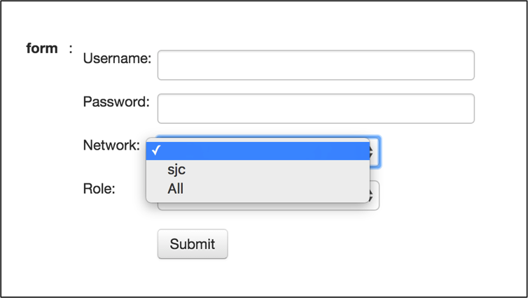

Chapter 10: Web2Py - Capacity Planning Use Cases
************************************************

.. contents:: :local:

We have created a solid framework using web2py in the previous two sections “Prepare the Tool” and "Troubleshooting Use Cases." This section should be pretty straightforward to create the use cases for Capacity Planning with the framework. And that’s the goal of this book. Once we created the framework, you should be able to add plenty of use cases by spending time only on the core logic of your requirement than spending time on the web2py framework.

In this chapter, we are going to write two use cases that are Port Capacity and Hardware Tables Capacity.

.. image:: images/ch10-pic1.png

Port Capacity
=============

The goal of this use case is to find the unused ports and transceivers in the network. We have already created the Python script for this use case earlier in this book. From web2py perspective, when the user accesses the Port Capacity link from the home page, it should show the same form that asks for username, password, site and role.

Once the user provided the required information, the script collects the information about the unused ports and displays the result.

We are going to use the following steps to write the script.

Develop Script
--------------

#. Create a new Function and a View for this task “Port Capacity."
#. Use the eos_form() and switches_list() function to display form.
#. Create a function to discover the unused ports.

Step 1: Create a new Function and a View for this task “Port Capacity"
^^^^^^^^^^^^^^^^^^^^^^^^^^^^^^^^^^^^^^^^^^^^^^^^^^^^^^^^^^^^^^^^^^^^^^

Create a new function port_capacity() in the default.py controller.

.. code-block:: python

  def port_capacity():
      return dict()

Create a view port_capacity.html under views/default folder.

.. code-block:: html

  {{extend 'layout.html'}}
  <h1>Port Capacity </h1>
  {{=BEAUTIFY(response._vars)}}

Step 2: Use the eos_form() and switches_list() function to display form
^^^^^^^^^^^^^^^^^^^^^^^^^^^^^^^^^^^^^^^^^^^^^^^^^^^^^^^^^^^^^^^^^^^^^^^

We have written two functions eos_form() and switches_list() in the previous chapter. We will use those functions with this script to display form and derive IP addresses of the switches from the user selection.

.. code-block:: python

  def port_capacity():
      # Build Form
      form = eos_form()

      if form.process().accepted:
          # Create a switch IP addresses list from site and role selection
          switches = switches_list(form.vars)

      return dict(form=form)

Step 3: Create a function to discover the unused ports
^^^^^^^^^^^^^^^^^^^^^^^^^^^^^^^^^^^^^^^^^^^^^^^^^^^^^^

We will create a new function discover_unused_ports() and reuse the script that we wrote in chapter 4. Then we will call this function from the port_capacity() function.

.. code-block:: python

  def discover_unused_ports(node):
      # Define a dictionary for unused_ports
      unused_ports = {}

      # Collect the model name and device description
      show_inventory = node.execute(["show inventory"])
      model = str(show_inventory["result"][0]["systemInformation"]["name"])
      description = str(show_inventory["result"][0]["systemInformation"][
          "description"])
      unused_ports = {"Model": model, "Description": description}

      # Collect interfaces status
      sh_int_status_raw = node.execute([
          "show interfaces status notconnect disabled"])
      sh_int_status = sh_int_status_raw["result"][0]["interfaceStatuses"]

      for each_interface in sh_int_status.keys():
          bandwidth = sh_int_status[each_interface]["bandwidth"]
          bandwidth_GE = str(bandwidth / 1000000000) + "GE"
          interface_type = str(sh_int_status[each_interface]["interfaceType"])

          # check for bandwidth entry and add it if not there
          if bandwidth_GE not in unused_ports:
              unused_ports[bandwidth_GE] = {}

          # check for interface type and add it if not there
          if interface_type not in unused_ports[bandwidth_GE]:
              unused_ports[bandwidth_GE][interface_type] = 1
          else:
              unused_ports[bandwidth_GE][interface_type] += 1

      return unused_ports

  def port_capacity():
      form = eos_form()
      if form.process().accepted:
          switches = switches_list(form.vars)

          # Create an Empty Dictionary
          unused_ports = {}
          errors = {}

          for switch in switches:
              try:
                  # Define API Connection String
                  node = pyeapi.connect(transport="https", host=switch,
                                        username=form_vars.username,
                                        password=form_vars.password,
                                        port=None)

                  # Collect hostname for reporting purpose
                  switchname = host_name(node)

                  # Discover Unused Ports
                  unused_ports[switchname] = discover_unused_ports(node)

                  # If there are no unused ports, delete the entry for the switch
                  if not unused_ports[switchname]:
                      del unused_ports[switchname]

              except pyeapi.eapilib.ConnectionError:
                  errors[switch] = "ConnectionError: unable to connect to eAPI"

              except pyeapi.eapilib.CommandError:
                  errors[switch] = "CommandError: Check your EOS command syntax"

          return dict(errors=errors, unused_ports=unused_ports)

      return dict(form=form)

Test your script using the URL https://<web-server>/Arista_EOS_Tool/default/port_capacity.

Hardware Scale
==============

We have built four use cases in the web2py. By now, you should be comfortable to build use cases in web2py by leveraging the existing functions and Python scripts. In this case, we are going to copy all the functions we created for hardware table scalability in chapter 4 in the web2py's default.py controller.

.. code-block:: python

  def mac_scale(node):
      show_mac = node.runCmds(1, ["show mac address-table count"])
      show_mac_clean = show_mac[0]["vlanCounts"]
      mac_count = 0
      for each_vlan in show_mac_clean.keys():
          mac_count += show_mac_clean[each_vlan]["dynamic"]
      return mac_count

  def vrf_scale(node):
      show_vrf = node.runCmds(1, ["show vrf | include ipv4,ipv6"], "text")
      show_vrf_clean = show_vrf[0]["output"]
      vrfs = []
      for line in show_vrf_clean.splitlines():
          fields = line.split()
          vrfs.append(fields[0])
      return vrfs

  def arp_scale(node, vrfs):
      arp_count = 0
      for each_vrf in vrfs:
          show_arp = node.runCmds(1, [
              "show ip arp vrf " + each_vrf + " summary"])
          arp_count += show_arp[0]["dynamicEntries"]
      return arp_count

  def route_scale(node, vrfs):
      route_count = 0
      for each_vrf in vrfs:
          show_route = node.runCmds(1, [
              "show ip route vrf " + each_vrf + " summary"])
          route_count += show_route[0]["totalRoutes"]
      return route_count

  def tcam_scale(node):
      tcam_count = 0
      show_tcam = node.runCmds(1, [
          "enable", "show platform trident tcam | include TCAM group"], "text")
      for each_line in show_tcam[1]["output"].splitlines():
          tcam_count += int(each_line.split()[4])
      return tcam_count

  def hostname(node):
      host_name = node.runCmds(1, ["show hostname"])
      host_name_clean = str(host_name[0]["hostname"])
      return host_name_clean

  def hardware_scale():
      form = eos_form()
      if form.process().accepted:
          form_vars = form.vars
          switches = switches_list(form_vars)

          # Hardware scale assessment script
          verify_scale = {}

          for switch in switches:
              try:
                  # Define Connection Attributes for jsonrpc
                  node = Server("https://" + form_vars.username + ":" +
                                form_vars.password + "@" + switch +
                                "/command-api")

                  # Call the hardware scale functions
                  name = hostname(node)
                  mac_count = mac_scale(node)
                  vrfs = vrf_scale(node)
                  arp_count = arp_scale(node, vrfs)
                  route_count = route_scale(node, vrfs)
                  tcam_count = tcam_scale(node)

                  # Store the values in a dictionary

                  verify_scale[name] = {"MAC Scale": mac_count,
                                        "Number of VRFs": len(vrfs),
                                        "Number of ARP Entries": arp_count,
                                        "Number of Routes": route_count,
                                        "Number of TCAM entries Used": tcam_count
                                        }

              except ProtocolError as e:
                  verify_scale[switch] = "Invalid EOS Command" + str(e)

              except:
                  verify_scale[switch] = "eAPI Connection Error"

          return dict(verify_scale=verify_scale)

      return dict(form=form)

Test your script using the URL https://<web-server>/Arista_EOS_Tool/default/hardware_scale.

Summary
=======

We have ported all the five use cases to the tool. You make a list of your common networking tasks and write the scripts using Python and then port it to the tool. You can also keep all the network-related documentation in this tool. Let's go to the next chapter to learn about the web2py view.
