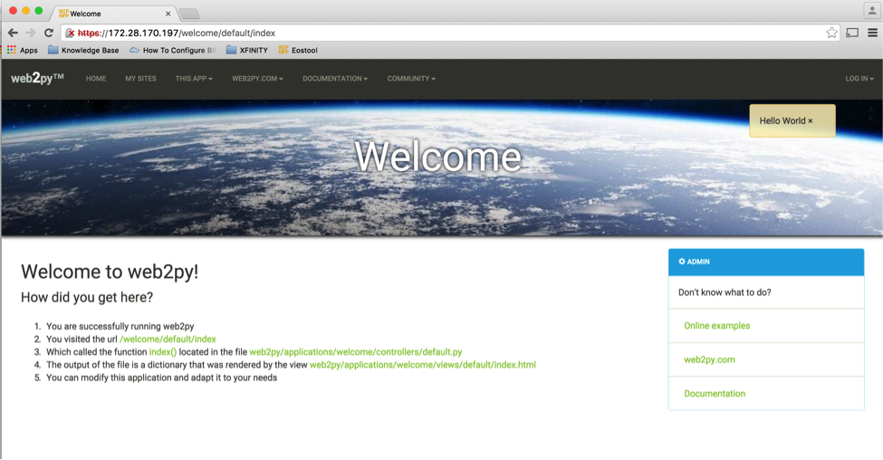

Chapter 6: Web2Py Installation
******************************

.. contents:: :local:

Web2py is an open source full stack framework. You can download web2py from `http://web2py.com/init/default/download <http://web2py.com/init/default/download>`_. You can install it on Windows, Apple Mac or any of the Linux distributions. Installation instruction is documented here `http://web2py.com/books/default/chapter/29/13/deployment-recipes <http://web2py.com/books/default/chapter/29/13/deployment-recipes>`_. In this chapter, we will show you how to install web2py in Ubuntu. Below is the quick installation steps to install and setup web2py on Ubuntu running Apache as the web server.

Install Required Packages
=========================

About My Linux
--------------

.. code-block:: bash

  anees@ubuntu-web2py:~$ uname -a
  Linux ubuntu-web2py 3.16.0-30-generic #40~14.04.1-Ubuntu SMP Thu Jan 15 17:43:14 UTC 2015 x86_64 x86_64 x86_64 GNU/Linux

  anees@ubuntu-web2py:~$ python --version
  Python 2.7.6

  anees@ubuntu-web2py:/$ ifconfig
  eth0      Link encap:Ethernet  HWaddr 00:0c:29:98:c8:32
            inet addr:172.28.170.197  Bcast:172.28.171.255  Mask:255.255.254.0
            inet6 addr: fe80::20c:29ff:fe98:c832/64 Scope:Link
            UP BROADCAST RUNNING MULTICAST  MTU:1500  Metric:1
            RX packets:97480 errors:0 dropped:0 overruns:0 frame:0
            TX packets:58948 errors:0 dropped:0 overruns:0 carrier:0
            collisions:0 txqueuelen:1000
            RX bytes:111218578 (111.2 MB)  TX bytes:10125393 (10.1 MB)

Install Required Packages for Python Development
------------------------------------------------

.. code-block:: bash

  anees@ubuntu-anees-1:~$ sudo apt-get install build-essential python-dev libsqlite3-dev libreadline6-dev libgdbm-dev zlib1g-dev libbz2-dev sqlite3 zip libssl-dev

Install Python modules
----------------------

.. code-block:: bash

  anees@ubuntu-web2py:~$ sudo apt-get install python-pip

  anees@ubuntu-web2py:~$ sudo pip install pyeapi

  anees@ubuntu-web2py:~$ sudo pip install jsonrpc

Install Apache
--------------

.. code-block:: bash

  anees@ubuntu-web2py:~$ sudo apt-get install apache2
  anees@ubuntu-web2py:~$ sudo apt-get install libapache2-mod-wsgi
  anees@ubuntu-web2py:~$ sudo a2enmod wsgi
  anees@ubuntu-web2py:~$ sudo a2enmod ssl
  anees@ubuntu-web2py:~$ sudo a2enmod proxy
  anees@ubuntu-web2py:~$ sudo a2enmod proxy_http
  anees@ubuntu-web2py:~$ sudo a2enmod headers
  anees@ubuntu-web2py:~$ sudo a2enmod expires
  anees@ubuntu-web2py:~$ sudo a2enmod rewrite

Create SSL Certificate
----------------------

.. code-block:: bash

  anees@ubuntu-web2py:~$ sudo mkdir /etc/apache2/ssl
  anees@ubuntu-web2py:~$ sudo sh -c 'openssl genrsa 1024 > /etc/apache2/ssl/self_signed.key'

  anees@ubuntu-web2py:~$ sudo chmod 400 /etc/apache2/ssl/self_signed.key

  anees@ubuntu-web2py:~$ sudo sh -c 'openssl req -new -x509 -nodes -sha1 -days 365 -key /etc/apache2/ssl/self_signed.key > /etc/apache2/ssl/self_signed.cert'
  You are about to be asked to enter information that will be incorporated
  into your certificate request.
  What you are about to enter is what is called a Distinguished Name or a DN.
  There are quite a few fields but you can leave some blank
  For some fields there will be a default value,
  If you enter '.', the field will be left blank.
  -----
  Country Name (2 letter code) [AU]:US
  State or Province Name (full name) [Some-State]:CA
  Locality Name (eg, city) []:San Jose
  Organization Name (eg, company) [Internet Widgits Pty Ltd]:Arista
  Organizational Unit Name (eg, section) []:Services
  Common Name (e.g. server FQDN or YOUR name) []:ubuntu-web2py.mylab.com
  Email Address []:admin@mylab.com

  anees@ubuntu-web2py:~$ sudo sh -c 'sudo openssl x509 -noout -fingerprint -text < /etc/apache2/ssl/self_signed.cert > /etc/apache2/ssl/self_signed.info'

Install Web2Py
==============

.. code-block:: bash

  anees@ubuntu-web2py:~$ cd /home
  anees@ubuntu-web2py:/home$
  anees@ubuntu-web2py:/home$ sudo mkdir www-data
  anees@ubuntu-web2py:/home$ cd www-data/

  anees@ubuntu-web2py:/home/www-data$ sudo wget http://web2py.com/examples/static/web2py_src.zip

  anees@ubuntu-web2py:/home/www-data$ sudo unzip web2py_src.zip
  anees@ubuntu-web2py:/home/www-data$ sudo mv web2py/handlers/wsgihandler.py web2py/wsgihandler.py

  anees@ubuntu-web2py:/home/www-data$ sudo chown -R www-data:www-data web2py

Configure Apache to use mod_wsgi
--------------------------------

.. code-block:: bash

  anees@ubuntu-anees-1:~$ cd /etc/apache2/sites-available

  anees@ubuntu-anees-1:/etc/apache2/sites-available$ sudo vi web2py.conf

  WSGIDaemonProcess web2py user=www-data group=www-data processes=1 threads=1

  <VirtualHost *:80>

    RewriteEngine On
    RewriteCond %{HTTPS} !=on
    RewriteRule ^/?(.*) https://%{SERVER_NAME}/$1 [R,L]

    CustomLog /var/log/apache2/access.log common
    ErrorLog /var/log/apache2/error.log
  </VirtualHost>

  <VirtualHost *:443>
    SSLEngine on
    SSLCertificateFile /etc/apache2/ssl/self_signed.cert
    SSLCertificateKeyFile /etc/apache2/ssl/self_signed.key

    WSGIProcessGroup web2py
    WSGIScriptAlias / /home/www-data/web2py/wsgihandler.py
    WSGIPassAuthorization On

    <Directory /home/www-data/web2py>
      AllowOverride None
      Require all denied
      <Files wsgihandler.py>
        Require all granted
      </Files>
    </Directory>

    AliasMatch ^/([^/]+)/static/(?:_[\d]+.[\d]+.[\d]+/)?(.*) \
          /home/www-data/web2py/applications/$1/static/$2

    <Directory /home/www-data/web2py/applications/*/static/>
      Options -Indexes
      ExpiresActive On
      ExpiresDefault "access plus 1 hour"
      Require all granted
    </Directory>

    CustomLog /var/log/apache2/ssl-access.log common
    ErrorLog /var/log/apache2/error.log
  </VirtualHost>

  :wq!

  anees@ubuntu-web2py:/etc/apache2/sites-available$ cd ..
  anees@ubuntu-web2py:/etc/apache2$ cd sites-enabled/
  anees@ubuntu-web2py:/etc/apache2/sites-enabled$ sudo rm *.*
  anees@ubuntu-web2py:/etc/apache2/sites-enabled$ sudo a2ensite web2py

  anees@ubuntu-anees-1:/etc/apache2/sites-available$ sudo service apache2 restart

Start Web2Py Service
====================

.. code-block:: bash

  anees@ubuntu-anees-1:/etc/apache2/sites-available$ cd /home/www-data/web2py

  anees@ubuntu-anees-1:/home/www-data/web2py $
  sudo -u www-data python -c "from gluon.widget import console; console();"

  anees@ubuntu-anees-1:/home/www-data/web2py $
  sudo -u www-data python -c "from gluon.main import save_password; save_password(raw_input('admin password: '),443)"

  ***** You will be prompted to setup the web2py admin password ****
  admin password:

Verify Web2Py Portal
--------------------

Verify the web2py portal by launching from your browser. In our example, we will launch web2py portal using the url https://172.28.170.197.

