Chapter 5: Web2Py Introduction
******************************

.. contents:: :local:

I hope that you are comfortable in writing Python scripts to automate some of the network operational tasks by now. So far we are writing the code and storing in a Python (.py) file and run the script from terminal or from any Python development environment. Next step is to improve the usability of the scripts you have written so far. How about if you can host all the Python scripts you have written so far in a web based tool? This way you can access the tool anywhere from the network using your browser. And you can share the tool with your team.

As you start learning Python, you will start to consume lot of Python modules written by the community. With the web based tool, you have to install those modules only on the servers where you are hosting your Python scripts. All the users who are consuming the tool does not have to install any of these modules and they don’t even need to have Python installed on their systems.

What do we need to do to build a web based tool and host the Python scripts?. We need a web framework such as Web2Py or Django. In this book, we are going to use Web2Py as our web framework. Since the fundamental principal of this book is to teach you Python and web2py by using the networking use cases, we are going to explain the web2py framework by using the tool we are going to build.

We are going to build a tool like this:

.. image:: images/ch05-pic1.png

We will first understand the tool and then we will review how it is implemented using web2py framework. Primary purpose of the tool is to host your Python scripts. As you can see that some of the scripts we created in the previous chapters were listed under network-wide troubleshooting and capacity planning sections. We are going to add a provision in the tool where you can manually add the IP addresses of the switches in the network. Prepare the tool section allows you to add IP addresses of the switches to the tool.

Once you added the list of switches in the tool, you can run your tasks under capacity planning and network-wide troubleshooting against those switches. We will walk through the tool to better understand what we are going to build using web2py framework.

Understanding the functionality of the Tool
===========================================

The purpose of the tool is to run common network operational tasks across multiple Arista switches in the network.

Prepare the Tool
----------------

Users should be able to add switches to the tool as and when they roll out new Arista switches in the network. We are also going to add an option to categorize switches based on site and role. This gives an option to run the operational tasks selectively on the switches belong to specific site and role.

Add Switches
^^^^^^^^^^^^

Add switches will allow you to add the list of IP addresses of the Arista switches. It requires username and password as well.

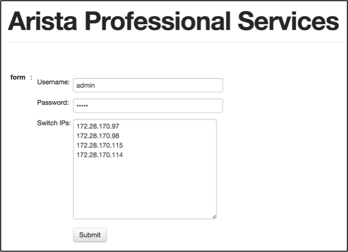

After you provide all information and hit submit, the script will collect switch name, model and software version from the switches and then it stores the data in a file locally in the server. We will show you the file name and the path when we show you how to build this tool later in this book. The add switches task also displays the inventory of the switches we are adding in the output as below.

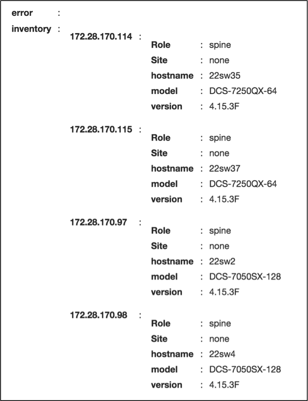

Categorize Switches
^^^^^^^^^^^^^^^^^^^

When you click "Categorize Switches", the script will pull the inventory information of the switches we added in the "Add Switches" task from the file stored in the server.

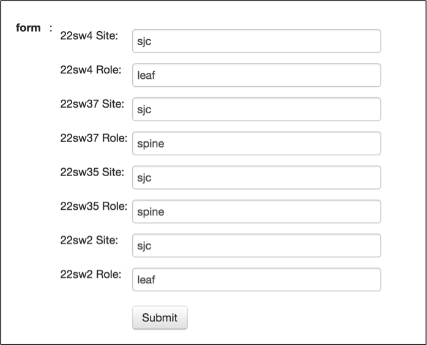

For each switch, it will show the configured site and role. For the switches added through "Add Switches" task, these two fields will be configured as none. You can manually update each switch with corresponding site and role as per your network design.

View Switches
^^^^^^^^^^^^^

You can view the current inventory of the switches using "View Switches" task.

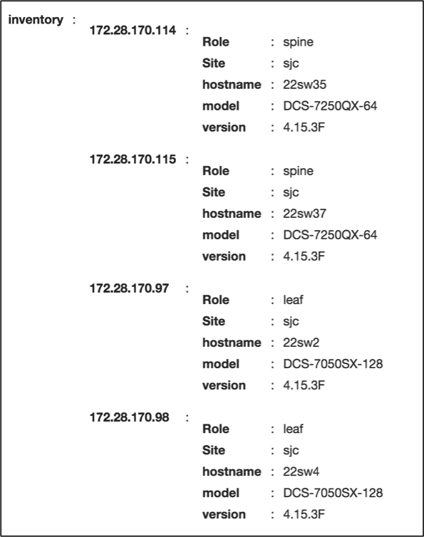

Capacity Planning
-----------------

We will just see how to run one of the tasks in this category to understand how the tool works.

Port Capacity
^^^^^^^^^^^^^

When you click "Port Capacity" task, it will prompt you for username, password, site and role. If you want to run the task on all the switches, select All for both site and role fields. Basically site and role fields give you the flexibility to select the list of switches to which you want to run the task.

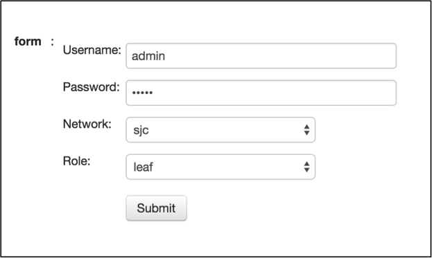

After you enter username, password, site and role, the script will run against the switches based on your selection and displays the inventory of unused ports.

.. image:: images/ch05-pic7.png

Network-wide Troubleshooting
----------------------------

We will just see how to run one of the tasks in this category to understand how the tool works.

Packet Drops
^^^^^^^^^^^^

Almost all the use cases will prompt you the same form. The data you need to provide is the username and password of the switches and then select the site and role.

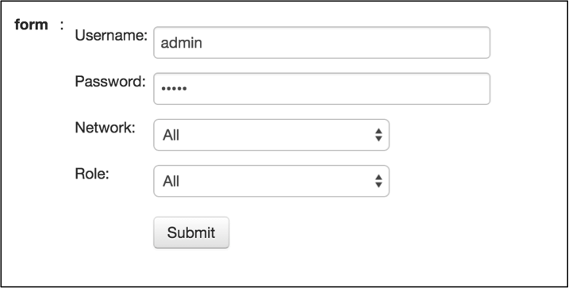

After you enter username, password, site and role, the script will run against the switches based on your selection. It displays the switch name and the interfaces where the packet drops are observed in the network.

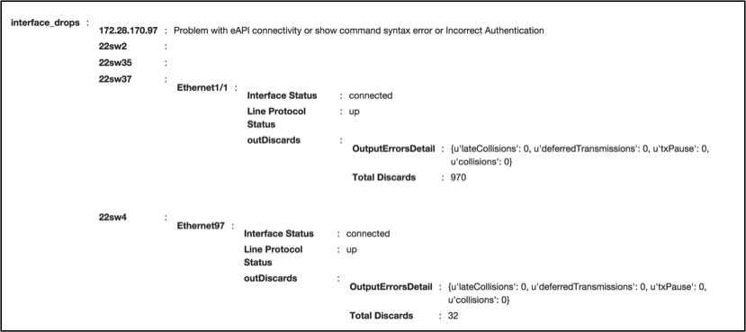

Web2Py Framework for the Tool
=============================

Web2Py can be downloaded from `www.web2py.com <http://www.web2py.com>`_ and installed on most of the desktop and server operating systems. Web2Py can be considered as server side application systems and you need a web tier to serve the applications to clients. You can either use the Rocket WSGI web server that installed with Web2Py or you can leverage other web servers such as Apache. In our example, we will use Apache web server running on top of Ubuntu Linux operating systems to host our tool.

Web2Py Framework
----------------

The web2py instance can server multiple applications. Each application has a controller (default.py) where you write your Python scripts and a view which generates html page to interact with end users.

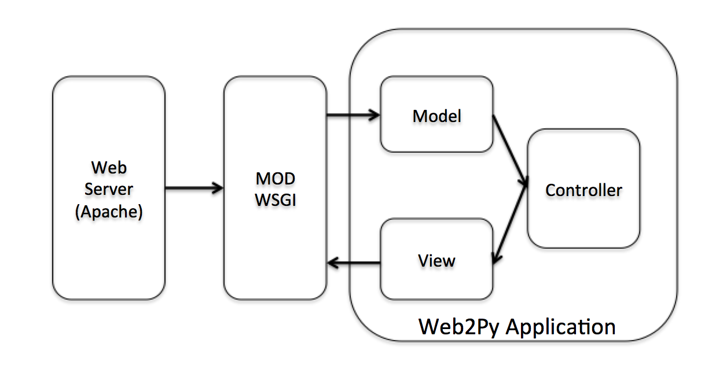

We are going to explore the web2py components of our specific application in this section. Then we will show you how to build the entire application from scratch in this book. Let us explore the web2py components from the front page of our tool.

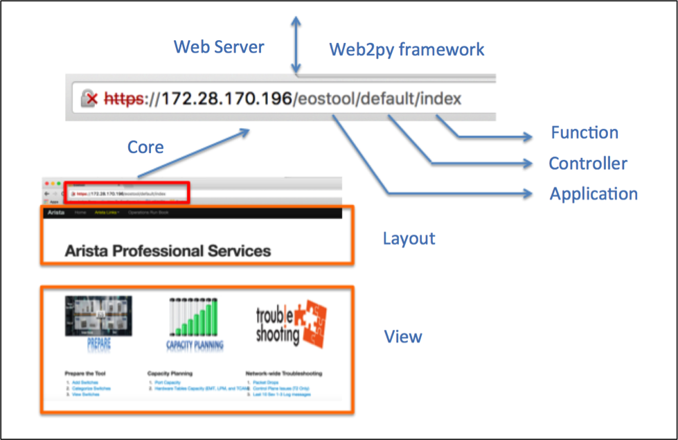

As you can see from the URL, our application name is “eostool”, controller name is “default” and the function name is “index”.

Once web2py is installed, you can create multiple applications. In our example, we created an application called “eostool”. The below screenshot shows the list of applications created in our web2py instance.

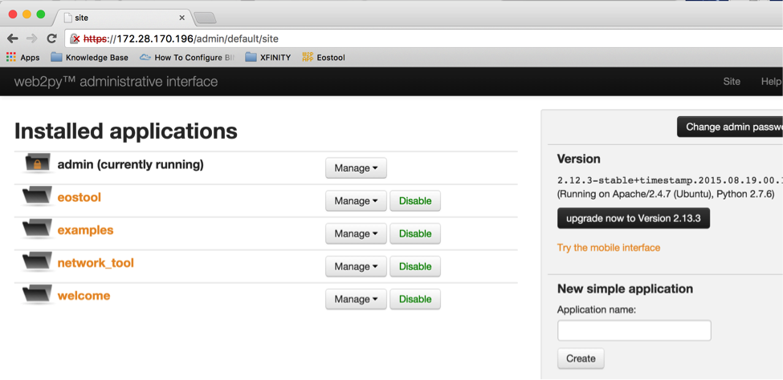

Using Web2Py's web administrative interface, you can create applications. Each application follows MVC (Model, View and Controller) framework.

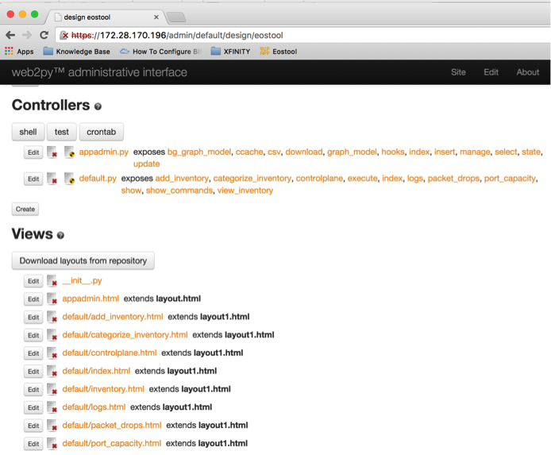

Controller
----------

Default controller name for any web2py application is default.py. This is where we write all our Python scripts. You can edit default.py using web2py administrative interface.

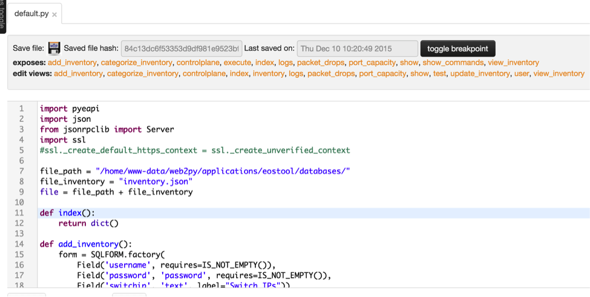

In the previous chapters, we created separate files for each of our use cases. In web2py, each of the use cases corresponds to a function in the default controller. Port capacity, hardware scalability assessment, data plane and control plane drops are all separate functions in the default controller.

For example, Add Switches in our tool is a function called add_inventory() which is in the controller default.py.

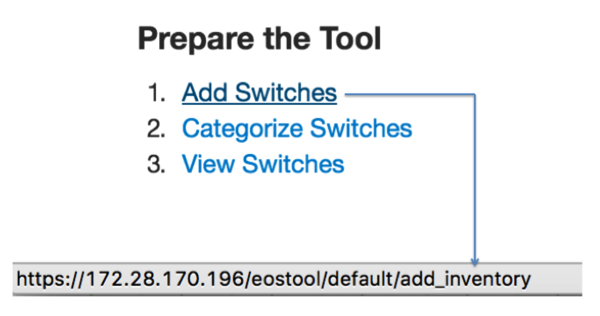

Home page of the application "eostool" is also a function called index() in the controller default.py.

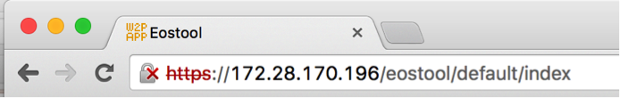

Views
-----

The tool has to interact with the end users to collect the input and also to display the result of your Python script. As we know that each function in the default controller is your Python script performs specific network operations task. Each task requires user interface to collect the input from users and to display result. We will create "web2py view" for each function to facilitate the user interface. View is nothing but a html file and the name of the html file is same as the name of the function in the default controller. For example view of the function add_inventory() is add_inventory.html.

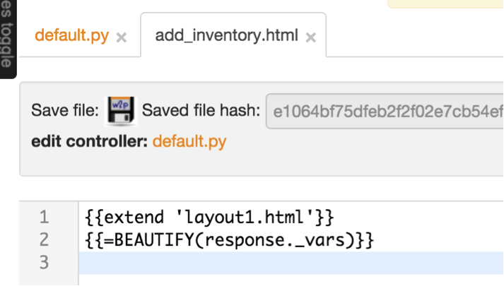

Whenever you need to create a new network operations task (Python script), you will create a separate function in this default.py controller and a separate view for your function. Then you can add a link in the home page (index.html).

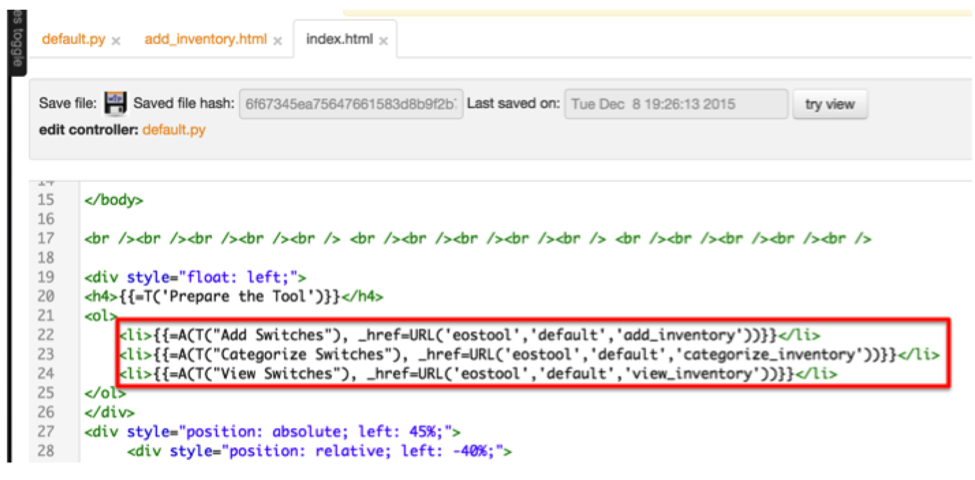
